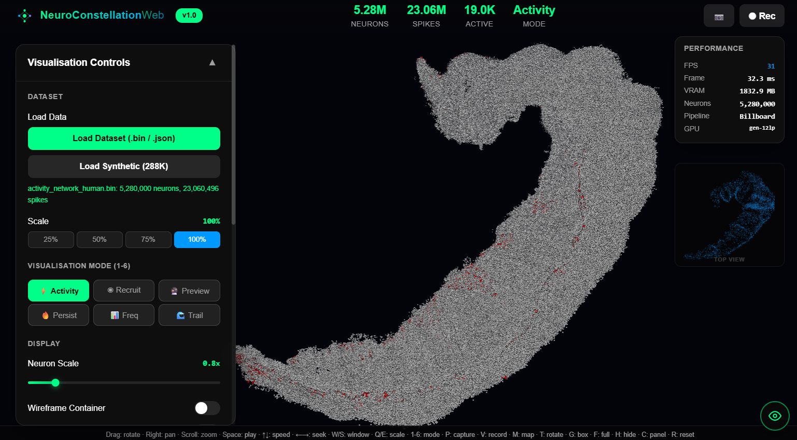

<div align="center">

# 🧠 NeuroConstellation Web

**Browser-based visualisation of large-scale hippocampal neural activity using WebGPU**

[](https://www.w3.org/TR/webgpu/)
[](LICENSE)
[](https://www.ebrains.eu/)
[](https://www.uniss.it/)

<br>

*No installation. No plugins. No build tools. Just open and explore.*

<br>



---

</div>

## 🔬 Overview

NeuroConstellation Web brings large-scale neural population visualisation into the browser. Hundreds of thousands to millions of neurons rendered with interactive spike activity playback — powered entirely by WebGPU compute shaders running inside the browser sandbox.

The GPU compute pipeline was translated line-by-line from Unity HLSL to WebGPU WGSL. The mathematical formulations behind all six visualisation modes are identical to the validated desktop implementation. Nothing was simplified, approximated, or left out.

<table>
<tr>
<td width="50%">

**🐭 Mouse Hippocampus CA1**
- 288,027 neurons
- 1,527,485 spike events
- 981.9 ms recording duration
- 4 anatomical layers (SO, SP, SR, SLM)

</td>
<td width="50%">

**🧬 Human Hippocampus CA1**
- 5,280,000 neurons
- 23,060,496 spike events
- 995.2 ms recording duration
- 4 anatomical layers (SO, SP, SR, SLM)

</td>
</tr>
</table>

---

## 🎨 Six Visualisation Modes

| # | Mode | What it shows |
|:-:|------|--------------|
| 1 | **Real-Time Activity** | Linear decay from spike onset — watch individual neurons fire |
| 2 | **Recruitment Map** | Three-state classification: active / ever-spiked / silent |
| 3 | **Forward Preview** | Upcoming spikes within a 5 ms lookahead window |
| 4 | **Activity Persistence** | Exponential decay heatmap (τ = 200 ms) |
| 5 | **Firing Rate Map** | Logarithmic frequency encoding with 5-stop colour gradient |
| 6 | **Spike History Trail** | Multi-checkpoint temporal trail at 0, 5, 10, 20, 40 ms |

All six modes preserve the validated formulations from the desktop Unity implementation (Chapter 4, Table 8).

---

## ⚡ Quick Start

[🚀 Open NeuroConstellation Web](https://safeeralimirani.github.io/NeuroConstellationWeb/)


That's it. No `npm install`, no build step, no configuration.

---

## 🌐 Browser Support

| Browser | Version | Status |
|---------|---------|--------|
| Chrome | 113+ | ✅ Supported |
| Edge | 113+ | ✅ Supported |
| Firefox | 141+ | ✅ Supported |
| Safari | 18+ | ✅ Supported |

---

## 📂 Data Formats

<details>
<summary><b>Binary format (.bin)</b> — flat arrays, fastest loading</summary>
<br>

Matches the VarjoNeuronDataManager buffer layout:
- **Positions**: Float32, N × 3 values
- **Spike times**: Float32, N × MaxSpikesPerNeuron, padded with `float.MaxValue` sentinels
- **Spike counts**: Int32, N values

</details>

<details>
<summary><b>JSON format</b> — human-readable, auto-detected column order</summary>
<br>

Nested arrays with automatic detection of `[neuronId, time]` vs `[time, neuronId]` ordering.

</details>

<details>
<summary><b>Synthetic generator</b> — built-in 288K neuron test data</summary>
<br>

Generates a hippocampal-shaped distribution of 288,027 neurons with configurable spike rates. Useful for quick testing without the actual dataset files.

</details>

---

## 🎮 Controls

<table>
<tr>
<td>

| Key | Function |
|-----|----------|
| `Space` | Play / Pause |
| `← / →` | Seek ±10 ms |
| `↑ / ↓` | Adjust speed |
| `W / S` | Activation window |
| `Q / E` | Neuron scale |

</td>
<td>

| Key | Function |
|-----|----------|
| `1–6` | Select mode |
| `P` | Screenshot (PNG) |
| `V` | Record video (WebM) |
| `F` | Fullscreen |
| `H` | Toggle UI |

</td>
</tr>
</table>

**Mouse**: left-drag rotates · right-drag pans · scroll zooms

**Touch**: single-finger rotates · pinch zooms

---

## 🏗️ Architecture

```
┌──────────────────────────────────────────────────────────┐
│                   NeuroConstellation Web                 │
├────────────┬────────────┬────────────┬───────────────────┤
│    Data    │    WGSL    │  Billboard │    Interactive    │
│   Loader   │   Compute  │  Renderer  │     Controls      │
│            │            │            │                   │
│  .bin      │  256-thread│  6 verts/  │   6 modes         │
│  .json     │  workgroups│  neuron    │   orbital camera  │
│  synthetic │  per frame │  single    │   playback        │
│            │            │  draw call │   screenshot/video│
└────────────┴────────────┴────────────┴───────────────────┘
          │                │                │
          ▼                ▼                ▼
     GPU Buffers     Compute Pass      Render Pass
     (5 bindings)    ceil(N/256)       draw(6, N)
```

| Component | Detail |
|-----------|--------|
| **Rendering** | Billboard instanced quads · circular fragment masking · single draw call |
| **Depth cueing** | Atmospheric fog · distance-based size attenuation · radial glow kernel |
| **Tone mapping** | Reinhard HDR compression |
| **GPU buffers** | 128-byte uniform · spike times · spike counts · activations · mode data |
| **Capture** | PNG screenshots · WebM video recording (VP9, 60 FPS, 8 Mbps) |

---

## 🔗 Part of the NeuroConstellation Platform Family

| Platform | Display | Neurons | Interaction | Thesis |
|----------|---------|---------|-------------|--------|
| **Desktop** | Monitor | 5.28M @ 60–100 FPS | Mouse / Keyboard | Ch. 4 |
| **HoloNeV** | HoloLens 2 MR | 288K @ 90+ FPS | Keyboard | Ch. 5 |
| **Dynamic MR** | HoloLens 2 MR | 288K @ 60–90 FPS | MRTK hand gestures | Ch. 6 |
| **Varjo VR** | Varjo XR-4 VR | 5.28M | Ultraleap hand tracking | Ch. 7 |
| **Web** ← | Any browser | 288K–5.28M | Mouse / Keyboard / Touch | Ch. 8 |

Five platforms. One rendering principle. GPU indirect instancing consolidates entire neuron populations into a single draw call — from a laptop GPU to a VR headset to a browser tab.

---

## 👥 Authors

**Safeer Ali Mirani** · PhD Candidate
Department of Life Sciences and Biotechnologies, University of Sassari

**Pirah Memon** · Researcher
Department of Life Sciences and Biotechnologies, University of Sassari

**Supervisors**: Prof. Paolo Enrico · Prof. Sergio M.G. Solinas

---

## 💰 Funding

This work was supported by:

- **EBRAINS-Italy** — Project IR00011, European Union NextGeneration EU (CUP B51E22000150006)
- **FeNeL** — Italian MUR, PNRR M4.C2.1.1 PRIN 2022 No. 2022JE5SK2 (CUP G53D23000480006)

---

<div align="center">

<br>

**🧠 From simulation data to interactive exploration — no barriers.**

*Desktop · Mixed Reality · Virtual Reality · Web*

<br>

</div>
